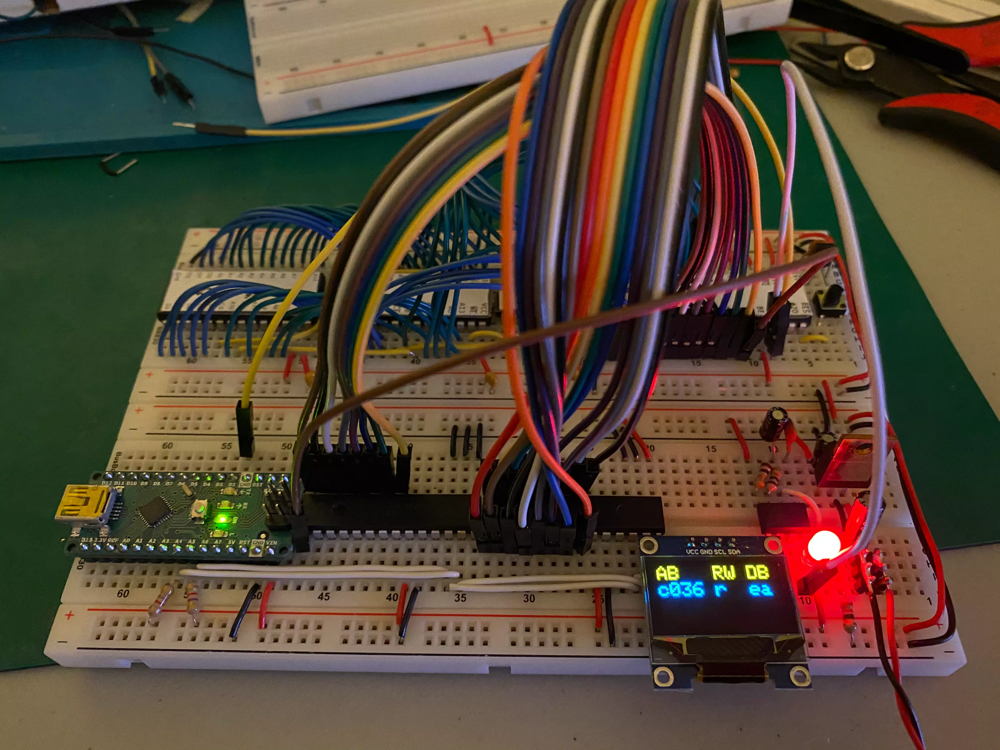
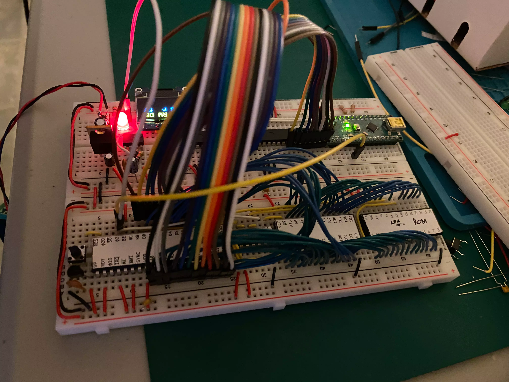
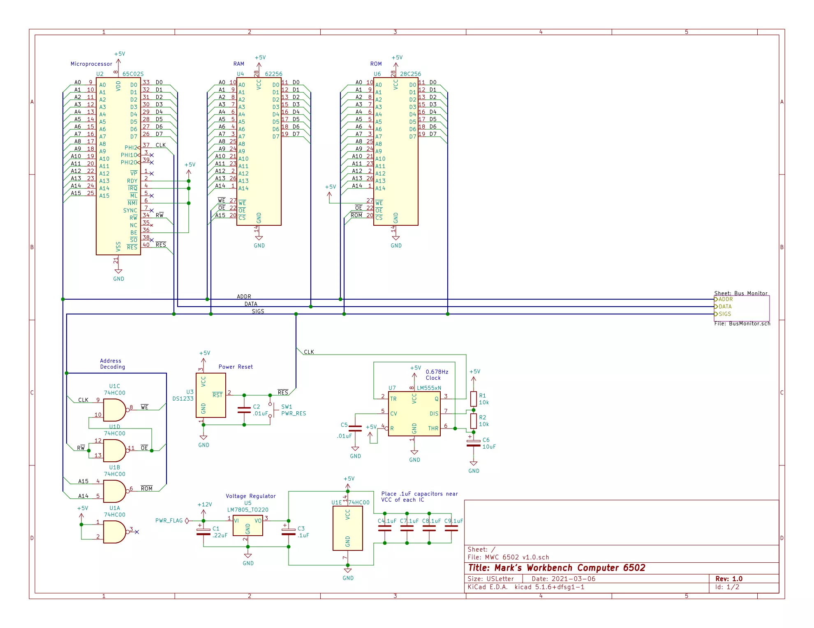
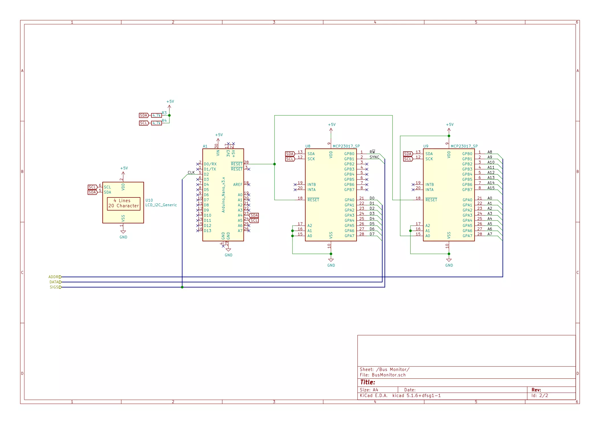

MWC 6502
========

This is my attempt at building a workbench computer using a 6502 processor.

Build Log
---------

### March 17, 2021

Configuration:

- [65C02S μP](https://www.westerndesigncenter.com/wdc/w65c02s-chip.php)
- 62256 32kB RAM
- 28C256 32kB EEPROM (only upper 16kB addressable)
- 74HC00 NAND gates for address decoding
- DS1233 for power reset
- Diagnostics components
  - Arduino Nano + 2 I²C I/O expanders + 555 timer running at ~0.678Hz as a clock
  - Will likely be removed for the final product

Using an Arduino Nano with a couple of I²C I/O expanders (MCP23017) allows me to inspect the address and data bus as well as RW̅ and Sync signals. I have the Clock signal connected to an interrupt pin on the Nano which triggers an ISR to read the bus which is then displayed over the serial port. I had an OLED display working for a while, but it broke and I haven't had time to troubleshoot yet. The Sync signal is used to determine when an instruction is being read, and then I'm crudely mapping the opcode to a mnemonic.

The ROM is just full of `NOP` (`ea`) opcodes for now as I work on the diagnostics stuff. I've built a few of these so far and I've had no success with serial output via a 6551. I need better visibility into what's going on. 

Next steps are to add a button for stepping through clock cycles manually, possibly resolving the OLED display issue, and then adding a VIA and ACIA.

I want the OLED display because then I can disconnect the USB cable from the Arduino. I don't like the weird power behavior when it's connected.

I plan on just setting up LEDs on all the VIA outputs for now to potentially use for more troubleshooting or just verification that the VIA is working. Then I will focus on getting RS-232 working with the ACIA. Supposedly this should be simple, but I've never gotten real data to traverse the cable. I want the ability to access the machine via a terminal for easier loading and running programs.
